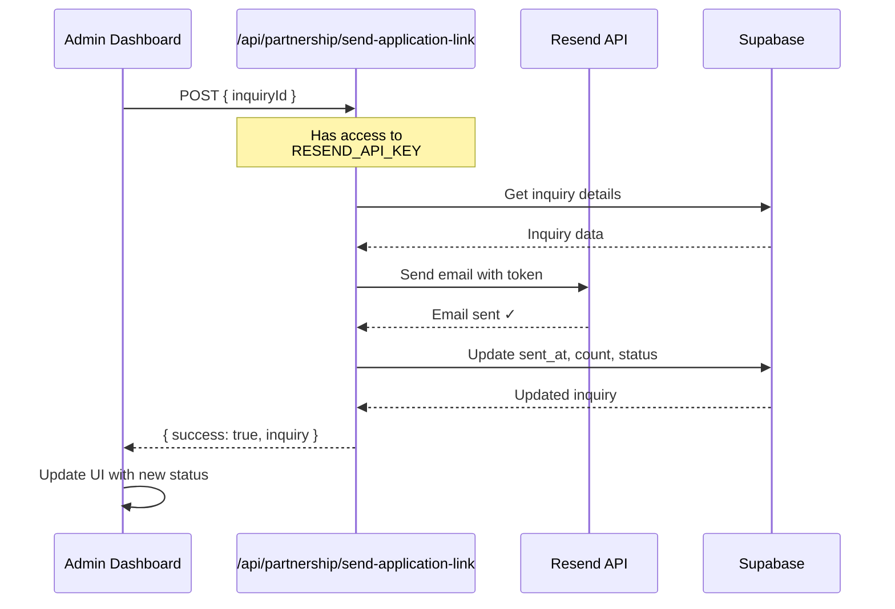

# Fix: Missing API Key Error - SOLVED

## The Problem

You were getting "Missing API key" error because the admin dashboard (client-side) was trying to access `process.env.RESEND_API_KEY`, which is **NOT available in the browser**.

### Why Other Emails Worked

- ✅ **Partner inquiry emails** → Sent from API route `/app/api/partner-inquiry/route.ts` (server-side) → Has access to env vars
- ❌ **Application link emails** → Sent from admin dashboard component (client-side) → NO access to env vars

## The Solution

Created a proper API route architecture:

```
Admin Dashboard (Client)
    ↓ calls
API Route (Server) → Has RESEND_API_KEY → Sends Email
    ↓ returns
Admin Dashboard (updates UI)
```

### Files Created/Modified

1. **NEW**: `/app/api/partnership/send-application-link/route.ts`
   - Server-side API route that handles email sending
   - Has access to `process.env.RESEND_API_KEY`

2. **MODIFIED**: `/src/page-components/Dashboard/AdminDashboard.tsx`
   - Now calls the API route instead of sending email directly
   - Removed direct import of `sendApplicationInvite`

3. **NEW**: `/PARTNER_INQUIRIES_TRACKING_MIGRATION.sql`
   - SQL script to add tracking columns

---

## What You Need To Do

### Step 1: Run Database Migration

**Go to Supabase Dashboard → SQL Editor → New Query**

Paste and run this SQL:

```sql
ALTER TABLE partner_inquiries 
ADD COLUMN IF NOT EXISTS application_link_send_count INTEGER DEFAULT 0,
ADD COLUMN IF NOT EXISTS application_link_last_send_status TEXT;

-- Backfill existing records
UPDATE partner_inquiries 
SET application_link_send_count = 1,
    application_link_last_send_status = 'success'
WHERE application_link_sent_at IS NOT NULL 
  AND application_link_send_count IS NULL;
```

Or just run the file: `PARTNER_INQUIRIES_TRACKING_MIGRATION.sql`

### Step 2: Restart Dev Server

```bash
# Stop server (Ctrl+C), then:
npm run dev
```

### Step 3: Test

1. Go to admin dashboard → Partner Inquiries
2. Click "Send Link" on a qualified inquiry
3. ✅ Should work now! Email will send successfully
4. Check your admin email inbox for the invitation
5. Check candidate email inbox for the invitation

---

## How It Works Now



---

## Testing Checklist

- [ ] Database migration run successfully
- [ ] Dev server restarted
- [ ] Clicked "Send Link" - no errors in console
- [ ] Received email at candidate address
- [ ] Received notification at admin address
- [ ] Button changed to "Resend Link"
- [ ] Status shows "✓ Sent [date]"
- [ ] Clicking "Resend Link" sends again with same URL
- [ ] Status shows send count: "(2x)", "(3x)"

---

## Why This Fix Was Necessary

In Next.js:
- **Server-side** (API routes) → `process.env` available
- **Client-side** (React components in browser) → `process.env` NOT available

The original implementation violated this rule by trying to access env vars from client-side code.

**The proper pattern**: Client → API Route (server) → Email Service

This is now implemented correctly.

---

## Troubleshooting

**Still getting errors?**

1. Check that migration ran:
   ```sql
   SELECT column_name 
   FROM information_schema.columns 
   WHERE table_name = 'partner_inquiries' 
     AND column_name LIKE 'application_link%';
   ```

2. Check that API route exists:
   ```bash
   ls app/api/partnership/send-application-link/route.ts
   ```

3. Check browser Network tab:
   - Should see POST to `/api/partnership/send-application-link`
   - Should return 200 OK with `{ success: true }`

4. Check server console logs for any errors

---

## Benefits of This Architecture

✅ **Secure** - API keys never exposed to browser  
✅ **Reliable** - Server-side has consistent env var access  
✅ **Maintainable** - Standard Next.js pattern  
✅ **Testable** - API route can be tested independently

---

You're all set! The "Send Link" feature should now work perfectly.
